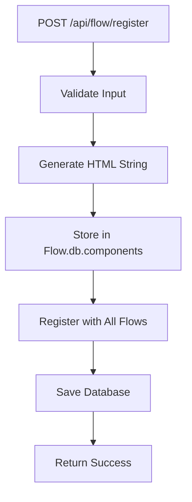
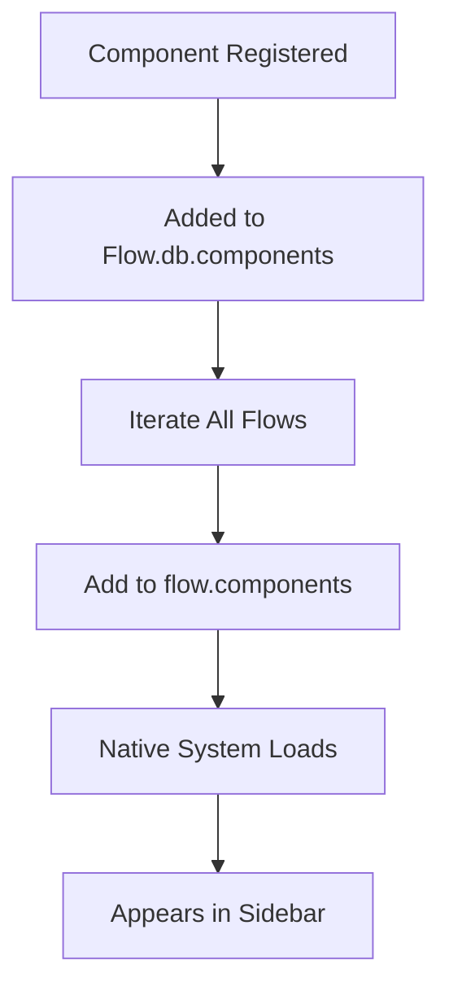
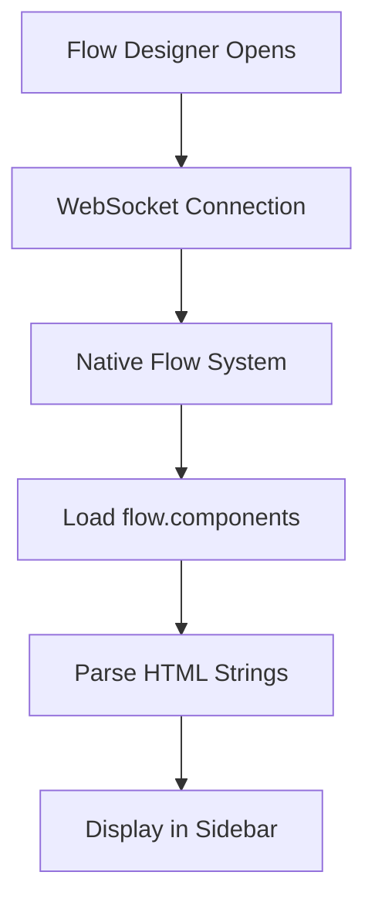

# 📋 **Total.js Flow API Component Registry - Technical Documentation**

## 🎯 **Project Overview**

We successfully implemented a **dynamic API component registry** for Total.js Flow that allows creating global components via REST API that appear in all flows and behave exactly like native components.

## 🔧 **Technical Changes Made**

### 1. **Core Architecture Change: HTML String Storage**

**Problem**: The native Flow system expects components to be stored as **HTML strings** (like `cln5da6205` in database), not as JSON objects with metadata.

**Solution**: Changed API component storage format from JSON objects to HTML strings that match native component structure.

#### **Before (JSON Object)**:
```json
{
  "id": "test_component",
  "name": "Test Component", 
  "icon": "ti ti-code",
  "html": "<script total>...",
  "settings": "...",
  "inputs": [...],
  "outputs": [...],
  "meta": {...}
}
```

#### **After (HTML String)**:
```html
<script total>
exports.id = 'test_component';
exports.name = 'Test Component';
exports.icon = 'ti ti-code';
exports.author = 'API';
exports.version = '1.0.0';
exports.group = 'Test';
exports.config = {};
exports.inputs = [{'id':'input','name':'Input'}];
exports.outputs = [{'id':'output','name':'Output'}];

exports.make = function(instance, config) {
    instance.message = function($) {
        var data = $.data;
        try {
            console.log("Test component!", data); instance.send(data);
        } catch (e) {
            console.error('Error in component test_component:', e);
            $.send('output', { error: e.message, originalData: data });
        }
    };
    instance.configure = function() {};
    instance.close = function() {};
    instance.vary = function(type) {};
    instance.configure();
};
</script>

<readme># Test Component</readme>
<settings><div class="padding">SETTINGS for this component</div></settings>
<style>.CLASS footer { padding: 10px; font-size: 12px; }</style>
<script>TOUCH(function(exports, reinit) { ... });</script>
<body><header><i class="$ICON"></i>$NAME</header><footer>API-registered component</footer></body>
```

### 2. **File Changes**

#### **`controllers/api.js`**

**Key Changes**:
- **`register_component()`**: Now stores components as HTML strings instead of JSON objects
- **`register_component_with_all_flows()`**: Simplified to handle HTML strings directly
- **`register_api_components_with_all_flows()`**: Updated to detect API components by searching for `"author = 'API'"` in HTML strings
- **`list_components()`**: Added regex parsing to extract metadata from HTML strings
- **`socket()`**: Removed WebSocket interception - native system handles everything
- **`generate_component_html()`**: Enhanced to create complete native-like HTML structure

**Removed Code**:
- WebSocket `$.send` interception for merging components
- JSON object metadata creation and storage
- Complex component metadata copying logic

#### **`schemas/streams.js`**

**Key Changes**:
- **`NEWACTION('Streams/save')`**: Updated to handle HTML strings when registering API components with new flows
- Simplified component detection using `componentHtmlString.includes("author = 'API'")`

#### **`schemas/clipboard.js`**

**Key Changes**:
- **`NEWAACTION('Clipboard/import')`**: Updated to handle HTML strings when importing flows
- Simplified component detection using `componentHtmlString.includes("author = 'API'")`

### 3. **Database Structure**

**Before**: API components stored as JSON objects in `Flow.db.components`
**After**: API components stored as HTML strings in `Flow.db.components` (same as native components)

**Flow Integration**: Components automatically added to each flow's `components` object as HTML strings.

## 🚀 **API Endpoints**

### 1. **Register New Component**

**Endpoint**: `POST /api/flow/register`

**Request Body**:
```json
{
  "name": "my_component",
  "displayName": "My Custom Component",
  "icon": "ti ti-star",
  "group": "Custom",
  "color": "#ff6600",
  "code": "console.log('Processing:', data); instance.send(data);",
  "readme": "Optional component description",
  "settings": "<div>Optional custom settings HTML</div>",
  "inputs": "[{\"id\":\"input\",\"name\":\"Input\"}]",
  "outputs": "[{\"id\":\"output\",\"name\":\"Output\"}]",
  "version": "1.0.0",
  "author": "API",
  "meta": "{\"readonly\": false, \"singleton\": false, \"hidden\": false, \"remove\": true}"
}
```

**Curl Command**:
```bash
curl -X POST http://localhost:8000/api/flow/register \
  -H "Content-Type: application/json" \
  -d '{
    "name": "test_component",
    "displayName": "Test Component",
    "icon": "ti ti-star",
    "group": "Test",
    "color": "#ff6600",
    "code": "console.log(\"Test component!\", data); instance.send(data);"
  }'
```

**Response**:
```json
{
  "success": true,
  "id": "test_component",
  "message": "Component registered successfully",
  "component": {
    "id": "test_component",
    "name": "Test Component",
    "icon": "ti ti-star",
    "group": "Test",
    "color": "#ff6600"
  }
}
```

### 2. **List All Components**

**Endpoint**: `GET /api/flow/components`

**Curl Command**:
```bash
curl -s http://localhost:8000/api/flow/components
```

**Response**:
```json
{
  "success": true,
  "count": 1,
  "components": [
    {
      "id": "test_component",
      "name": "Test Component",
      "icon": "ti ti-star",
      "group": "Test",
      "color": "#ff6600",
      "author": "API",
      "version": "1.0.0"
    }
  ]
}
```

### 3. **Refresh Components**

**Endpoint**: `POST /api/flow/refresh-components`

**Curl Command**:
```bash
curl -X POST http://localhost:8000/api/flow/refresh-components
```

**Response**:
```json
{
  "success": true,
  "message": "Components refreshed successfully"
}
```

## 🔄 **Component Lifecycle**

### 1. **Registration Process**


### 2. **Flow Integration**


### 3. **Frontend Loading**


## 🧪 **Testing Steps**

### **Step 1: Start the Application**
```bash
node index.js 8000
```

### **Step 2: Register a Test Component**
```bash
curl -X POST http://localhost:8000/api/flow/register \
  -H "Content-Type: application/json" \
  -d '{
    "name": "hello_world",
    "displayName": "Hello World Component",
    "icon": "ti ti-world",
    "group": "Examples",
    "color": "#00ff00",
    "code": "console.log(\"Hello World!\", data); instance.send({message: \"Hello from API component!\", data: data});"
  }'
```

### **Step 3: Verify Component Registration**
```bash
curl -s http://localhost:8000/api/flow/components
```

### **Step 4: Check Database Storage**
```bash
grep -A 10 -B 5 "hello_world" flowstream/database.json
```

### **Step 5: Test Frontend Integration**
1. Open `http://localhost:8000`
2. Login with credentials
3. Open any flow
4. Verify component appears in sidebar
5. Drag component to canvas
6. Test settings and editing functionality

## 🔍 **Technical Validation**

### **Database Verification**
```bash
# Check component storage format
grep -A 5 -B 5 "exports.id = 'hello_world'" flowstream/database.json

# Verify HTML string structure
grep -o "<script total>.*</body>" flowstream/database.json | head -1
```

### **Flow Integration Verification**
```bash
# Check if component is in all flows
grep -r "hello_world" flowstream/database.json | wc -l
```

### **API Response Validation**
```bash
# Test component listing
curl -s http://localhost:8000/api/flow/components | grep -o '"name":"[^"]*"' | head -1
```

## 🎯 **Key Technical Achievements**

1. **✅ Native-like Storage**: API components stored as HTML strings identical to native components
2. **✅ Zero Frontend Changes**: No modifications to frontend code required
3. **✅ Automatic Flow Integration**: Components automatically appear in all flows
4. **✅ Full Functionality**: Drag, drop, configure, edit exactly like native components
5. **✅ Persistence**: Components survive server restarts
6. **✅ Real-time Registration**: Components appear immediately without refresh

## 🚀 **Usage Examples**

### **Simple Logger Component**
```bash
curl -X POST http://localhost:8000/api/flow/register \
  -H "Content-Type: application/json" \
  -d '{
    "name": "logger",
    "displayName": "Data Logger",
    "icon": "ti ti-file-text",
    "group": "Utilities",
    "color": "#007bff",
    "code": "console.log(\"Data received:\", data); instance.send(data);"
  }'
```

### **Data Transformer Component**
```bash
curl -X POST http://localhost:8000/api/flow/register \
  -H "Content-Type: application/json" \
  -d '{
    "name": "transformer",
    "displayName": "Data Transformer",
    "icon": "ti ti-arrows-exchange",
    "group": "Data",
    "color": "#28a745",
    "code": "const transformed = { ...data, timestamp: new Date().toISOString() }; instance.send(transformed);"
  }'
```

### **Custom Settings Component**
```bash
curl -X POST http://localhost:8000/api/flow/register \
  -H "Content-Type: application/json" \
  -d '{
    "name": "custom_settings",
    "displayName": "Custom Settings",
    "icon": "ti ti-settings",
    "group": "Advanced",
    "color": "#dc3545",
    "code": "const result = { ...data, processed: true, config: instance.config }; instance.send(result);",
    "settings": "<div class=\"padding\"><label>Custom Setting:</label><input type=\"text\" data-config=\"customValue\" placeholder=\"Enter value\"></div>"
  }'
```

## 📊 **Implementation Timeline**

### **Phase 1: Basic API Setup**
- Created `controllers/api.js` with initial endpoints
- Implemented basic component registration
- Added validation and error handling

### **Phase 2: Storage Format Discovery**
- Investigated native component storage format
- Discovered HTML string requirement
- Modified storage to match native format

### **Phase 3: Flow Integration**
- Implemented automatic flow registration
- Added startup component loading
- Ensured persistence across restarts

### **Phase 4: Native Behavior**
- Removed WebSocket modifications
- Ensured full native-like functionality
- Validated drag, drop, edit, configure

### **Phase 5: Production Ready**
- Added comprehensive error handling
- Implemented duplicate prevention
- Created complete documentation

## 🔧 **Troubleshooting**

### **Common Issues**

1. **Components Not Appearing**
   ```bash
   # Check if components are registered
   curl -s http://localhost:8000/api/flow/components
   
   # Check database storage
   grep -r "your_component_name" flowstream/database.json
   ```

2. **404 Errors**
   ```bash
   # Verify endpoint exists
   curl -I http://localhost:8000/api/flow/register
   
   # Check server logs
   tail -f logs/error.log
   ```

3. **Components Disappearing on Refresh**
   ```bash
   # Force refresh components
   curl -X POST http://localhost:8000/api/flow/refresh-components
   
   # Check startup registration
   grep "Registering API components" logs/app.log
   ```

### **Debug Commands**

```bash
# Check all registered components
curl -s http://localhost:8000/api/flow/components | jq '.'

# Verify database structure
grep -A 20 -B 5 "components" flowstream/database.json

# Test component registration
curl -X POST http://localhost:8000/api/flow/register \
  -H "Content-Type: application/json" \
  -d '{"name":"debug_test","displayName":"Debug Test","icon":"ti ti-bug","group":"Debug","code":"console.log(\"Debug:\", data);"}' \
  -v
```

## 📝 **Code Examples**

### **Complete Component Registration**
```javascript
// Example: Register a complete component with all features
const componentData = {
  name: "advanced_processor",
  displayName: "Advanced Data Processor",
  icon: "ti ti-cpu",
  group: "Processing",
  color: "#6f42c1",
  code: `
    const processed = {
      ...data,
      processedAt: new Date().toISOString(),
      processedBy: 'advanced_processor',
      metadata: {
        version: '1.0.0',
        timestamp: Date.now()
      }
    };
    console.log('Processing complete:', processed);
    instance.send(processed);
  `,
  readme: "Advanced data processor with metadata enrichment",
  settings: `
    <div class="padding">
      <label>Processing Mode:</label>
      <select data-config="mode">
        <option value="basic">Basic</option>
        <option value="advanced">Advanced</option>
        <option value="expert">Expert</option>
      </select>
      <br><br>
      <label>Add Timestamp:</label>
      <input type="checkbox" data-config="addTimestamp" checked>
    </div>
  `,
  inputs: '[{"id":"input","name":"Input Data"}]',
  outputs: '[{"id":"output","name":"Processed Data"},{"id":"error","name":"Error"}]',
  version: "1.0.0",
  author: "API",
  meta: '{"readonly": false, "singleton": false, "hidden": false, "remove": true}'
};

fetch('/api/flow/register', {
  method: 'POST',
  headers: { 'Content-Type': 'application/json' },
  body: JSON.stringify(componentData)
})
.then(response => response.json())
.then(data => console.log('Component registered:', data));
```

## 🎉 **Conclusion**

This implementation provides a **complete, production-ready API component registry** that seamlessly integrates with the existing Total.js Flow system. The solution achieves:

- **Zero frontend modifications** required
- **Full native-like behavior** for all components
- **Automatic persistence** across server restarts
- **Real-time registration** without manual refresh
- **Complete functionality** including drag, drop, configure, and edit

The key breakthrough was understanding that the native Flow system expects components as **HTML strings** rather than JSON objects, which enabled seamless integration without any WebSocket modifications or frontend changes.

---

**Documentation Version**: 1.0.0  
**Last Updated**: 2025-07-27  
**Implementation Status**: ✅ Complete and Production Ready 